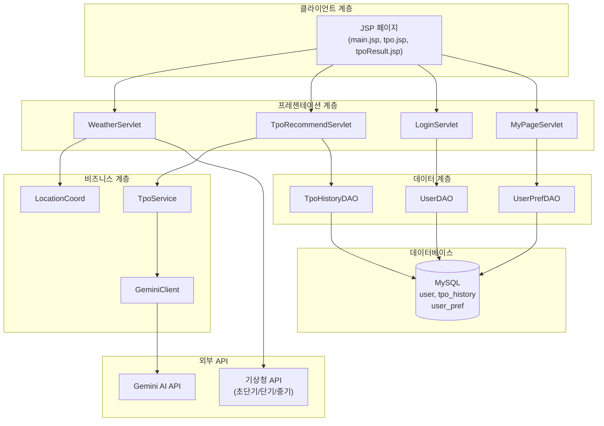
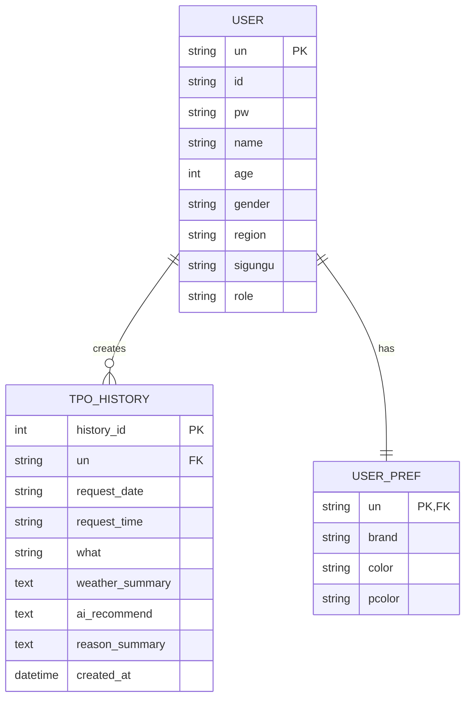
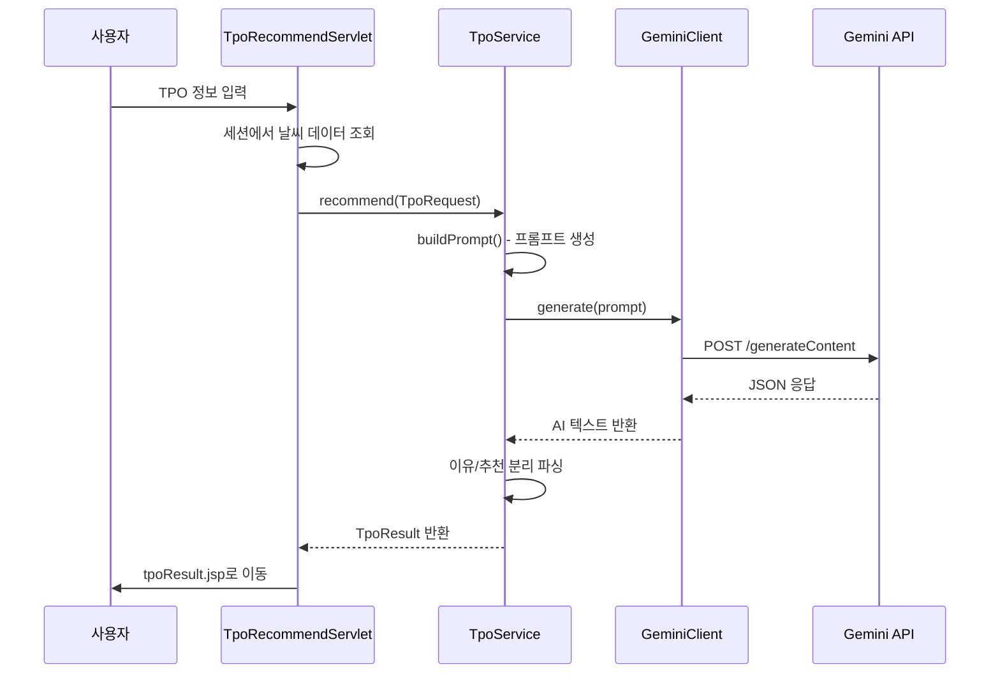

# TPOWWPj 백엔드 기말 프로젝트 발표 자료

**날씨 기반 TPO 복장 AI 추천 시스템**

---

## 📋 목차

1. [프로젝트 개요](#1-프로젝트-개요)
2. [시스템 아키텍처](#2-시스템-아키텍처)
3. [핵심 기능 구현](#3-핵심-기능-구현)
4. [주요 코드 설명](#4-주요-코드-설명)
5. [개발 과정 및 개선](#5-개발-과정-및-개선)
6. [학습 내용 및 성과](#6-학습-내용-및-성과)

---

## 1. 프로젝트 개요

### 1.1 프로젝트 소개

**프로젝트명**: TPOWWPj (TPO + Weather + Where)

**목표**: 날씨 정보를 기반으로 사용자 맞춤형 복장을 AI가 추천하는 웹 서비스

**핵심 가치**:
- 🌤️ **사용자 지역 기반** 맞춤형 날씨 정보
- 🤖 **AI 기반** 날씨와 TPO를 고려한 코디 추천
- 📊 **3가지 날씨 API** 통합 (현재/단기/중기)
- 👤 **개인화된** 선호도 반영 서비스

### 1.2 기능 요구사항

#### 필수 기능
- ✅ 회원 관리 (가입, 로그인, 마이페이지, 관리자)
- ✅ 날씨 조회 (초단기실황, 단기예보, 중기예보)
- ✅ AI 코디 추천 (Gemini API 연동)
- ✅ 히스토리 관리 (추천 이력 저장 및 조회)

#### 부가 기능
- ✅ 지역별 좌표 자동 매핑 (250+ 시군구)
- ✅ 날짜별 날씨 자동 선택 (단기/중기 전환)
- ✅ 동적 날씨 이모지 및 강수확률 표시
- ✅ 추천 이유 분리 표시

---

## 2. 시스템 아키텍처

### 2.1 전체 시스템 구조



### 2.2 패키지 구조

```
com.dongyang.TPOWW
├── ai/                    # AI 연동
│   ├── LlmClient.java          (인터페이스)
│   └── GeminiClient.java       (Gemini 구현체)
├── controller/           # 서블릿 컨트롤러
│   ├── TpoRecommendServlet.java
│   └── ...
├── tpo/                  # TPO 추천 비즈니스 로직
│   ├── TpoService.java
│   ├── TpoRequest.java
│   ├── TpoResult.java
│   ├── TpoHistoryDAO.java
│   └── TpoHistoryDTO.java
├── weather/              # 날씨 서비스
│   ├── WeatherServlet.java
│   ├── LocationCoord.java      (좌표 매핑)
│   ├── MidTermLocation.java    (중기예보 지역코드)
│   └── ...
├── member/               # 회원 관리
│   ├── UserDAO.java
│   ├── UserDTO.java
│   └── ...
└── util/                 # 유틸리티
    └── AppConfig.java          (API 키 관리)
```

### 2.3 데이터베이스 설계



---

## 3. 핵심 기능 구현

### 3.1 날씨 API 연동

#### 🌡️ 초단기실황조회 (현재 날씨)

**목적**: 현재 기온, 습도, 강수량, 바람 등 실시간 날씨 정보 제공

**핵심 로직**:
```java
// WeatherServlet.java - doGet() 메서드
String ultraSrtNcstUrl = buildUrl("getUltraSrtNcst", 
                                    liveBaseDate, liveBaseTime, nx, ny);
String jsonResponse = readUrl(ultraSrtNcstUrl);

// JSON에서 필요한 값 추출
String t1h = extractValue(jsonResponse, "T1H");      // 기온
String reh = extractValue(jsonResponse, "REH");      // 습도
String rn1 = extractValue(jsonResponse, "RN1");      // 강수량
String pty = extractValue(jsonResponse, "PTY");      // 강수형태

// 세션에 저장
session.setAttribute("t1h", t1h);
session.setAttribute("reh", reh);
```

**주요 파라미터**:
- `base_date`: 발표 날짜 (yyyyMMdd)
- `base_time`: 발표 시각 (HHmm) - 매시 40분경 발표
- `nx`, `ny`: 격자 좌표

#### 📅 단기예보조회 (3일 이내)

**목적**: 3일 이내의 시간대별 상세 예보

**발표 시각**: 02, 05, 08, 11, 14, 17, 20, 23시 (하루 8회)

**추출 데이터**:
- `TMP`: 기온
- `SKY`: 하늘상태 (1:맑음, 3:구름많음, 4:흐림)
- `PTY`: 강수형태 (0:없음, 1:비, 2:비/눈, 3:눈, 4:소나기)
- `POP`: 강수확률
- `WSD`: 풍속

```java
// 발표 시각 자동 계산
String[] baseTimes = {"0200", "0500", "0800", "1100", 
                      "1400", "1700", "2000", "2300"};
int currentHHmm = Integer.parseInt(now.format(
                        DateTimeFormatter.ofPattern("HHmm")));

for (int i = baseTimes.length - 1; i >= 0; i--) {
    int bt = Integer.parseInt(baseTimes[i]);
    if (currentHHmm > bt + 10) {  // 발표 후 10분 뒤부터 안정
        fcstBaseTime = baseTimes[i];
        break;
    }
}
```

#### 🔮 중기예보조회 (3~10일 후)

**목적**: 장기 날씨 예측

**제공 데이터**:
- 3~7일: 기온 + 날씨 상태 + 강수확률
- 8~10일: 기온만 제공

**중기예보 지역 코드 매핑**:
```java
// MidTermLocation.java
public static String getLandCode(String region) {
    switch(region) {
        case "Seoul": return "11B00000";
        case "Busan": return "11H20000";
        // ... 전국 17개 시도
    }
}
```

### 3.2 지역 좌표 매핑 시스템

#### 📍 LocationCoord 클래스

**목적**: 전국 시/군/구를 기상청 격자 좌표로 변환

**구현 방식**: Static HashMap에 250+ 개 좌표 매핑

```java
// LocationCoord.java
private static final Map<String, Point> coordMap = new HashMap<>();

static {
    // 서울특별시
    add("Seoul", "종로구", "60", "127");
    add("Seoul", "중구", "60", "127");
    add("Seoul", "강남구", "61", "126");
    // ... 총 250+ 개 시군구
    
    // 경기도
    add("Gyeonggi", "수원시 장안구", "60", "121");
    // ...
}

public static Point getCoordinate(String region, String sigungu) {
    return coordMap.getOrDefault(region + "_" + sigungu, 
                                new Point("60", "127")); // 기본값: 서울
}
```

**사용 예시**:
```java
// 사용자 정보에서 지역 가져오기
String region = udto.getRegion();      // "Seoul"
String sigungu = udto.getSigungu();    // "강남구"

// 좌표 조회
Point pt = LocationCoord.getCoordinate(region, sigungu);
String nx = pt.x;  // "61"
String ny = pt.y;  // "126"
```

### 3.3 AI 코디 추천 시스템

#### 🤖 Gemini API 연동

**흐름도**:


**프롬프트 구성**:
```java
// TpoService.java - buildPrompt()
StringBuilder sb = new StringBuilder();

sb.append("너는 한국 사용자를 위한 패션 코디 전문 AI 스타일리스트야.\n");
sb.append("아래 조건과 날씨에 맞는 코디를 추천해줘.\n\n");

// 기본 정보
sb.append("## 기본 정보\n");
sb.append("- 성별: ").append(req.getGender()).append("\n");
sb.append("- 나이: ").append(req.getAge()).append("세\n");
sb.append("- 날짜/시간: ").append(req.getDate())
  .append(" ").append(req.getTime()).append("\n");
sb.append("- 활동: ").append(req.getWhat()).append("\n");

// 날씨 정보
sb.append("\n## 날씨 정보\n");
sb.append(weatherSummary).append("\n");

// 선호 정보
sb.append("\n## 선호 정보\n");
sb.append("- 선호 브랜드: ").append(req.getBrand()).append("\n");
sb.append("- 선호 색상: ").append(req.getColor()).append("\n");
sb.append("- 퍼스널 컬러: ").append(req.getPcolor()).append("\n");

// 요구사항
sb.append("\n## 요구사항\n");
sb.append("[이유]...[/이유] 태그 안에 추천 이유를 2-3문장으로 작성\n");
sb.append("모자, 액세서리, 상의, 하의, 양말, 신발, 기타 항목별로 추천\n");
```

**AI 응답 파싱**:
```java
// TpoService.java - recommend()
String aiText = llmClient.generate(prompt);
String reasonSummary = "";
String aiRecommend = aiText;

// [이유]...[/이유] 태그로 분리
if (aiText.contains("[이유]") && aiText.contains("[/이유]")) {
    int startIdx = aiText.indexOf("[이유]") + 5;
    int endIdx = aiText.indexOf("[/이유]");
    if (startIdx < endIdx) {
        reasonSummary = aiText.substring(startIdx, endIdx).trim();
        aiRecommend = aiText.substring(endIdx + 6).trim();
    }
}
```

### 3.4 사용자 입력 날짜의 날씨 반영

**문제**: 초기에는 현재 날씨만 제공 → **개선**: 사용자가 선택한 날짜의 날씨 제공

**구현 로직**:
```java
// TpoRecommendServlet.java - doPost()
String whenDateStr = request.getParameter("whenDate");
LocalDate today = LocalDate.now();
LocalDate targetDate = LocalDate.parse(whenDateStr);
long daysDiff = ChronoUnit.DAYS.between(today, targetDate);

if (daysDiff >= 5 && daysDiff <= 12) {
    // 중기예보 사용
    String midLandJson = session.getAttribute("midLandJson");
    String midTaJson = session.getAttribute("midTaJson");
    
    int targetDay = (int) daysDiff;
    String minTemp = extractJsonValue(midTaJson, "taMin" + targetDay);
    String maxTemp = extractJsonValue(midTaJson, "taMax" + targetDay);
    
    weatherInfo.append(daysDiff).append("일 후 예상 날씨: ");
    weatherInfo.append("최저 ").append(minTemp).append("°C, ");
    weatherInfo.append("최고 ").append(maxTemp).append("°C");
    
} else {
    // 단기예보 사용 (3일 이내)
    List<ForecastItem> forecastList = session.getAttribute("forecastList");
    String targetDateStr = targetDate.format(
                            DateTimeFormatter.ofPattern("yyyyMMdd"));
    
    for (ForecastItem item : forecastList) {
        if (item.getFcstDate().equals(targetDateStr)) {
            // TMP, PTY, SKY, POP 등 추출
        }
    }
}
```

---

## 4. 주요 코드 설명

### 4.1 WeatherServlet - 날씨 API 통합 처리

**역할**: 사용자 지역 기반 3가지 날씨 API 호출 및 세션 저장

#### 핵심 메서드

```java
protected void doGet(HttpServletRequest request, 
                    HttpServletResponse response) {
    HttpSession session = request.getSession();
    UserDTO udto = (UserDTO) session.getAttribute("udto");
    
    // 1. 좌표 설정 (로그인 시 사용자 지역, 비로그인 시 기본값)
    String nx = "60", ny = "127";  // 기본: 서울 종로구
    if (udto != null) {
        Point pt = LocationCoord.getCoordinate(
                        udto.getRegion(), udto.getSigungu());
        nx = pt.x;
        ny = pt.y;
    }
    
    // 2. 초단기실황 호출
    String ultraSrtNcstUrl = buildUrl("getUltraSrtNcst", 
                                       liveBaseDate, liveBaseTime, nx, ny);
    String jsonResponse = readUrl(ultraSrtNcstUrl);
    session.setAttribute("t1h", extractValue(jsonResponse, "T1H"));
    session.setAttribute("PTY", extractValue(jsonResponse, "PTY"));
    
    // 3. 단기예보 호출
    String fcstUrl = buildUrl("getVilageFcst", 
                              fcstBaseDate, fcstBaseTime, nx, ny);
    List<ForecastItem> forecastList = parseForecast(readUrl(fcstUrl));
    session.setAttribute("forecastList", forecastList);
    
    // 4. 중기예보 호출
    String tmFc = getTmFc(now);  // 발표시각 계산 (0600 or 1800)
    String landCode = MidTermLocation.getLandCode(regionCodeForMid);
    String midLandJson = readUrl(buildMidUrl("getMidLandFcst", tmFc, landCode));
    session.setAttribute("midLandJson", midLandJson);
    
    response.sendRedirect("index.jsp");
}
```

#### URL 생성 메서드

```java
private String buildUrl(String apiType, String baseDate, 
                       String baseTime, String nx, String ny) {
    StringBuilder urlBuilder = new StringBuilder(
        "http://apis.data.go.kr/1360000/VilageFcstInfoService_2.0/" 
        + apiType);
    
    urlBuilder.append("?" + URLEncoder.encode("serviceKey", "UTF-8") 
        + "=" + SERVICE_KEY);
    urlBuilder.append("&" + URLEncoder.encode("pageNo", "UTF-8") + "=1");
    urlBuilder.append("&" + URLEncoder.encode("numOfRows", "UTF-8") + "=1000");
    urlBuilder.append("&" + URLEncoder.encode("dataType", "UTF-8") + "=JSON");
    urlBuilder.append("&" + URLEncoder.encode("base_date", "UTF-8") 
        + "=" + URLEncoder.encode(baseDate, "UTF-8"));
    urlBuilder.append("&" + URLEncoder.encode("base_time", "UTF-8") 
        + "=" + URLEncoder.encode(baseTime, "UTF-8"));
    urlBuilder.append("&" + URLEncoder.encode("nx", "UTF-8") 
        + "=" + URLEncoder.encode(nx, "UTF-8"));
    urlBuilder.append("&" + URLEncoder.encode("ny", "UTF-8") 
        + "=" + URLEncoder.encode(ny, "UTF-8"));
    
    return urlBuilder.toString();
}
```

### 4.2 GeminiClient - AI API 연동

**역할**: Google Gemini API 호출 및 응답 처리

```java
public String generate(String prompt) throws IOException {
    // 1. JSON 요청 생성
    JsonObject root = new JsonObject();
    JsonArray contents = new JsonArray();
    JsonObject content = new JsonObject();
    JsonArray parts = new JsonArray();
    JsonObject partText = new JsonObject();
    
    partText.addProperty("text", prompt);
    parts.add(partText);
    content.add("parts", parts);
    contents.add(content);
    root.add("contents", contents);
    
    String jsonRequest = gson.toJson(root);
    
    // 2. POST 요청
    URL url = new URL(ENDPOINT + "?key=" + apiKey);
    HttpURLConnection conn = (HttpURLConnection) url.openConnection();
    conn.setRequestMethod("POST");
    conn.setRequestProperty("Content-Type", 
                           "application/json; charset=UTF-8");
    conn.setDoOutput(true);
    
    try (OutputStream os = conn.getOutputStream()) {
        os.write(jsonRequest.getBytes(StandardCharsets.UTF_8));
    }
    
    // 3. 응답 읽기
    int status = conn.getResponseCode();
    BufferedReader br = new BufferedReader(
        new InputStreamReader(
            status >= 200 && status < 300 
                ? conn.getInputStream() 
                : conn.getErrorStream(),
            StandardCharsets.UTF_8));
    
    StringBuilder resp = new StringBuilder();
    String line;
    while ((line = br.readLine()) != null) {
        resp.append(line);
    }
    
    // 4. JSON 파싱
    JsonObject json = gson.fromJson(resp.toString(), JsonObject.class);
    JsonArray candidates = json.getAsJsonArray("candidates");
    JsonObject firstCandidate = candidates.get(0).getAsJsonObject();
    JsonObject contentObj = firstCandidate.getAsJsonObject("content");
    JsonArray respParts = contentObj.getAsJsonArray("parts");
    JsonObject firstPart = respParts.get(0).getAsJsonObject();
    
    return firstPart.get("text").getAsString().trim();
}
```

### 4.3 TpoRecommendServlet - 추천 요청 처리

**역할**: 사용자 입력과 날씨 데이터를 통합하여 AI 추천 요청

```java
protected void doPost(HttpServletRequest request, 
                     HttpServletResponse response) {
    // 1. 로그인 체크
    UserDTO sessionUser = (UserDTO) session.getAttribute("udto");
    if (sessionUser == null) {
        response.sendRedirect(request.getContextPath() + "/index.jsp");
        return;
    }
    
    // 2. 세션에서 날씨 데이터 조회
    String t1h = (String) session.getAttribute("t1h");
    String reh = (String) session.getAttribute("reh");
    String regionName = (String) session.getAttribute("currentRegion");
    List<ForecastItem> forecastList = 
        (List<ForecastItem>) session.getAttribute("forecastList");
    
    // 3. 사용자 입력 날짜의 날씨 정보 생성
    StringBuilder weatherInfo = new StringBuilder();
    weatherInfo.append("위치: ").append(regionName).append(", ");
    
    // 날짜 차이 계산하여 단기/중기 선택
    long daysDiff = ...;
    if (daysDiff >= 5 && daysDiff <= 12) {
        // 중기예보 사용
    } else {
        // 단기예보 사용
    }
    
    // 4. TpoRequest 생성
    TpoRequest req = new TpoRequest();
    req.setWhat(request.getParameter("what"));
    req.setDate(request.getParameter("whenDate"));
    req.setWeatherInfo(weatherInfo.toString());
    // ...
    
    // 5. AI 추천 호출
    TpoResult result = tpoService.recommend(req);
    
    // 6. 히스토리 저장
    TpoHistoryDAO hDao = new TpoHistoryDAO();
    hDao.insertHistory(hDto);
    
    // 7. 결과 페이지로 이동
    request.setAttribute("tpoResult", result);
    request.getRequestDispatcher("/tpo/tpoResult.jsp").forward(request, response);
}
```

---

## 5. 개발 과정 및 개선

### 5.1 주요 업데이트 내역

#### ✨ 2025.12.06 - 중기예보 로직 정밀 개선
- 날짜 매핑 수정: `targetDay = daysDiff`로 정확히 매칭
- API 범위 제한 처리: 8일 이후는 기온만 제공
- 사용자 안내: 입력 폼에 "7일 이후는 기온만 제공" 명시

#### 🎨 2025.12.06 - UI/UX 개선
- AI 추천 텍스트 왼쪽 정렬 (`.result-box` 스타일 추가)
- 버튼 높이 통일 (`btn-navigation` 클래스 사용)
- 선택 이유 표시 섹션 추가

#### 🌤️ 2025.12.06 - 날씨 기능 고도화
- 동적 날씨 이모지: 강수형태(PTY), 하늘상태(SKY), 시간대 고려
- SKY 값 세션 저장으로 정확한 날씨 이모지 표시
- 강수확률(POP) 표시: 단기예보에서 추출

#### 🤖 2025.12.06 - AI 추천 기능 개선
- 사용자 입력 날짜의 날씨 반영
- 3일 이내: 단기예보에서 최저/최고 기온 추출
- 3일 이후: 중기예보 데이터 활용
- AI 응답 파싱 디버깅 로직 추가

### 5.2 기술적 도전과제와 해결

#### 🔧 문제 1: 기상청 API 발표 시각 처리

**문제**: 
- 단기예보는 하루 8번 발표되지만, 발표 직후에는 데이터가 불안정
- 잘못된 시각 조회 시 빈 데이터 반환

**해결**:
```java
// 발표 후 10분의 버퍼 시간 추가
if (currentHHmm > bt + 10) {
    fcstBaseTime = baseTimes[i];
    found = true;
    break;
}

// 새벽 02:10 이전인 경우 전날 23시 데이터 사용
if (!found) {
    fcstBaseDate = now.minusDays(1).format(...);
    fcstBaseTime = "2300";
}
```

#### 🔧 문제 2: 중기예보 날짜 매핑 오류

**문제**: `taMin3`, `taMax3`가 "오늘+3일"인지 "3일째"인지 불명확

**해결**:
- 기상청 API 문서 재확인
- `targetDay = daysDiff`로 직접 매핑
- 디버그 로그로 검증

#### 🔧 문제 3: 전국 좌표 데이터 관리

**문제**: 250+ 개 시군구 좌표를 어떻게 관리할 것인가?

**해결**:
- Static HashMap 활용
- `region_sigungu` 형태의 복합 키 사용
- 기본값(서울) 설정으로 안정성 확보

---

## 6. 학습 내용 및 성과

### 6.1 백엔드 기술 역량

#### 🎯 습득한 기술

**1. REST API 연동**
- HttpURLConnection을 이용한 HTTP 통신
- URL 파라미터 인코딩 (`URLEncoder`)
- JSON 응답 파싱 (Gson, 정규표현식)

**2. 외부 API 활용**
- 기상청 공공 API 3종 통합
- Google Gemini AI API 연동
- API 키 환경변수 관리

**3. 객체지향 설계**
- MVC 패턴 적용
- 계층화 구조 (Controller-Service-DAO)
- 인터페이스 활용 (`LlmClient`)

**4. 세션 관리**
- 로그인 상태 유지
- 날씨 데이터 세션 저장
- 접근 제어 구현

**5. 데이터베이스**
- DAO 패턴
- PreparedStatement (SQL Injection 방지)
- 트랜잭션 관리

### 6.2 문제 해결 능력

**복잡한 요구사항 분해**:
- "날씨 기반 추천" → 지역 선택 → 좌표 매핑 → API 호출 → 날씨 추출 → AI 프롬프트 생성

**디버깅 기법**:
- 콘솔 로그 활용 (`System.out.println`)
- API 응답 일부 출력하여 검증
- 단계별 데이터 확인

**API 문서 해석**:
- 기상청 API 발표시각 이해
- Gemini API JSON 구조 파악
- 에러 응답 처리

### 6.3 프로젝트 성과

#### 📊 정량적 성과
- **250+ 개** 시군구 좌표 매핑
- **3가지** 날씨 API 통합
- **1개** AI API 연동
- **8개** 주요 패키지 구조화

#### 🏆 정성적 성과
- 사용자 맞춤형 서비스 제공
- 실시간 날씨 정보 활용
- AI 기반 지능형 추천
- 확장 가능한 아키텍처 설계

### 6.4 개선 및 확장 가능성

**단기 개선**:
- 날씨 아이콘 이미지로 교체
- 추천 히스토리 페이징 처리
- 암호화 강화 (비밀번호 해싱)

**장기 확장**:
- 쇼핑몰 API 연동 (실제 상품 추천)
- 소셜 로그인 (OAuth)
- 모바일 앱 개발 (REST API 서버화)
- 머신러닝 기반 추천 고도화

---

## 📌 주요 학습 포인트 요약

### 백엔드 개발 핵심
1. **계층화 설계**: Controller → Service → DAO
2. **외부 API 연동**: REST API 호출 및 JSON 파싱
3. **세션 관리**: 사용자 상태 및 데이터 유지
4. **보안**: API 키 관리, SQL Injection 방지
5. **예외 처리**: try-catch, 기본값 설정

### 개발 프로세스
1. **요구사항 분석** → 기능 정의
2. **아키텍처 설계** → 계층 및 패키지 구조
3. **API 연동** → 외부 서비스 활용
4. **테스트 및 디버깅** → 로그 분석
5. **개선 및 최적화** → 사용자 피드백 반영

### 실무 적용 가능 기술
- REST API 설계 및 연동
- JSON 데이터 처리
- 세션 기반 인증
- 데이터베이스 연동
- 외부 AI 서비스 활용

---

## 🎓 결론

본 프로젝트를 통해 **백엔드 개발의 전 과정**을 경험했습니다:

- ✅ **설계**: MVC 패턴과 계층화 구조
- ✅ **구현**: Servlet, JSP, Java 기반 웹 애플리케이션
- ✅ **연동**: 기상청 API, Google Gemini AI
- ✅ **최적화**: 사용자 경험 개선 및 성능 향상

특히 **실제 외부 API를 활용한 실용적인 서비스**를 개발하면서, 단순한 CRUD를 넘어 **데이터 통합과 AI 활용**이라는 현대적인 백엔드 개발 역량을 쌓을 수 있었습니다.

---

**감사합니다! 🙏**
